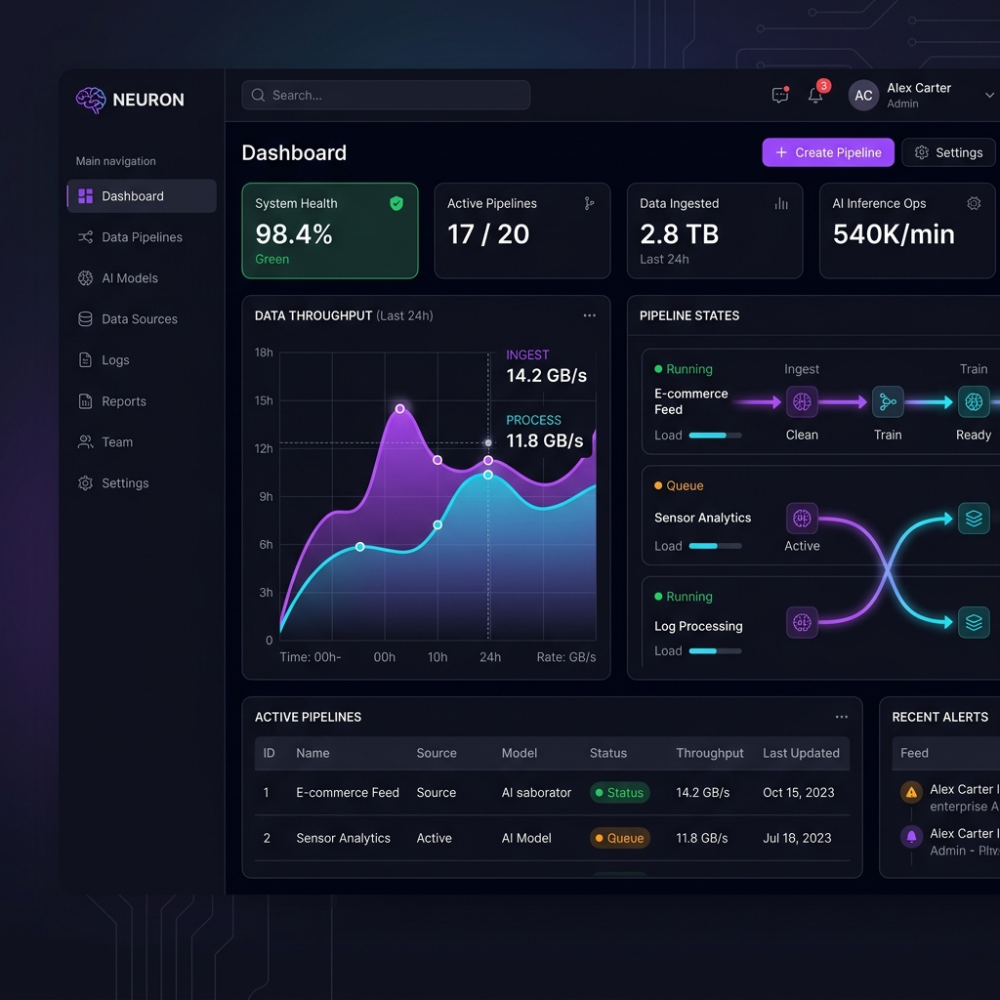
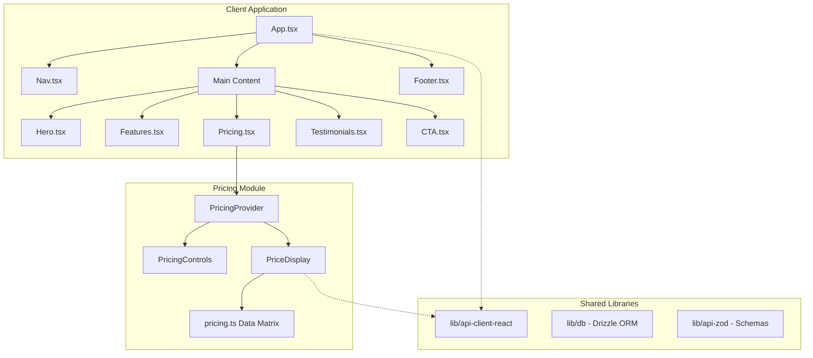

# Neuron — Enterprise AI Data Automation Platform

> A premium, high-performance, and fully accessible landing page showcasing Neuron, an advanced AI-powered data automation platform built for modern engineering teams.

[](https://opensource.org/licenses/MIT)
[](https://www.typescriptlang.org/)
[](https://react.dev/)
[](https://tailwindcss.com/)
[](https://vitejs.dev/)
[](https://pnpm.io/)

---

## 📖 Table of Contents

- [Hero Banner](#hero-banner)
- [Live Demo](#live-demo)
- [Overview](#overview)
- [Key Features](#key-features)
- [Screenshots](#screenshots)
- [Architecture](#architecture)
- [Project Flow](#project-flow)
- [Folder Structure](#folder-structure)
- [Technology Stack](#technology-stack)
- [Engineering Decisions](#engineering-decisions)
- [Pricing Logic](#pricing-logic)
- [Responsive Design](#responsive-design)
- [Accessibility (a11y)](#accessibility-a11y)
- [SEO Optimization](#seo-optimization)
- [Performance Optimization](#performance-optimization)
- [Installation & Local Setup](#installation--local-setup)
- [Configuration](#configuration)
- [Project Highlights](#project-highlights)
- [Future Roadmap](#future-roadmap)
- [License](#license)
- [Author](#author)
- [Acknowledgements](#acknowledgements)

---

## 🎨 Hero Banner

```md

```
> [!NOTE]
> *Note: If this banner asset does not exist in your repository yet, please add a descriptive banner at `./docs/banner.png` representing the dashboard's design system.*

---

## 🌐 Live Demo

* **Live Website URL**: *[Placeholder: Add deployment URL here, e.g. Vercel / Netlify]*
* **GitHub Repository**: [pavanbm-max/Titan-Assets](https://github.com/pavanbm-max/Titan-Assets.git)
* **Demo Video walkthrough**: *[Placeholder: Add YouTube/Loom demo video link]*

---

## 🔍 Overview

Neuron addresses a critical engineering problem: the overhead of building, monitoring, and scaling data pipelines while maintaining rigorous enterprise security compliance (SOC 2, GDPR, HIPAA). 

As a solution, **Neuron** serves as an enterprise-grade AI SaaS Landing Page showcasing an advanced data automation system. It targets data engineers, tech architects, and VP engineering managers by proposing a single cohesive workspace that connects over 200+ data sources, automates pipeline transforms, and executes sub-50ms queries over billion-row databases.

---

## ✨ Key Features

### ⚙️ Core Capabilities
- [x] **AI Dashboard Mockup**: A floating workspace visual detailing throughput activity, pipeline state steps, and system health statistics.
- [x] **Bento Grid Layout**: A clean, asymmetric desktop grid displaying product capabilities with dynamic mouse hover focus states.
- [x] **Mobile Accordion**: Interactive, custom-built mobile accordion that dynamically unfolds sections on screen sizes $< 768\text{px}$.
- [x] **Dynamic Pricing Matrix**: Dynamically calculated plan rates covering multiple regions, currencies, and discount cycles.

### ⚡ Performance & Optimization
- [x] **Render Isolation**: Interactive price toggles avoid parent re-renders, restricting DOM updates only to the pricing nodes.
- [x] **Reflow-Free Animations**: Transitions and keyframe cycles are composite-only (utilizing transform/opacity) to prevent layout recalculations.
- [x] **Minimal Footprint**: Clean workspace dependencies without bulky third-party animation libraries or design system wrappers.

### ♿ Accessibility (a11y)
- [x] **Semantic Document Structure**: Structured entirely via standard HTML5 landmarks (`<header>`, `<nav>`, `<main>`, `<section>`, `<footer>`).
- [x] **Keyboard Skip Link**: Skip to main content keyboard bypass is active for screen reader users on initial key tab.
- [x] **Accessible ARIA Attributes**: Conforms to dynamic WAI-ARIA states including `aria-pressed`, `aria-expanded`, and `aria-controls`.
- [x] **Visible Focus Rings**: Distinct rings outline focused interactive elements for keyboard navigation.

### 📈 Search Engine Optimization (SEO)
- [x] **Single H1 Rule**: Guaranteed single primary H1 landmark per layout.
- [x] **Metadata Structure**: Formatted with schema-ready title tags, viewport descriptions, canonical headers, and search index robots tags.
- [x] **Social Graphics (Open Graph)**: Rich thumbnail card parameters for Open Graph and Twitter Card crawlers.

---

## 📸 Screenshots

| Desktop Bento Grid | Dynamic Pricing Matrix |
| :---: | :---: |
| `` | `` |

| Mobile Accordion View | Desktop Dashboard Mockup |
| :---: | :---: |
| `` | `` |

---

## 🏗️ Architecture

The Neuron codebase is managed as a unified monorepo workspace divided into application layers and reusable library utilities:



---

## 🔄 Project Flow

The following flowchart details the user journey through the landing page conversion funnel:

```mermaid
graph LR
    Landing[User Lands on Page] --> HeroView[View Hero Headline & Dashboard]
    HeroView --> ScrollFeatures[Scroll to Bento Grid Features]
    ScrollFeatures --> HoverGrid[Interact with Bento Grid / Mobile Accordion]
    HoverGrid --> PricingView[Inspect Dynamic Pricing Matrix]
    PricingView --> ToggleCurrency[Toggle Currency USD/EUR/INR or Billing Period]
    ToggleCurrency --> Conversions[Click Start Free Trial / Contact Sales]
    Conversions --> LeadCaptured[User Onboarded / Sales Funnel Triggered]
```



---

## 📁 Folder Structure

Below is an overview of the workspace directories and their primary roles:

```filename
neuron/
├── artifacts/
│   ├── api-server/         # Express API Server endpoints
│   ├── mockup-sandbox/     # Mockup preview rendering sandboxes
│   └── titan/              # Main Frontend client (Vite + React 19)
│       ├── public/         # Public static assets & brand SVG icons
│       └── src/
│           ├── components/ # Section UI layout components (Hero, Features, Pricing, etc.)
│           ├── data/       # Static schemas and database matrices
│           ├── hooks/      # Custom state engines (usePricing, useMediaQuery)
│           ├── App.tsx     # Main application layout manager
│           ├── index.css   # Tailwind v4 configuration and global tokens
│           └── main.tsx    # Client entry point
├── lib/
│   ├── api-client-react/   # Autogenerated React Query client hooks
│   ├── api-spec/           # OpenAPI specs and configuration parameters
│   ├── api-zod/            # Zod validation schemas
│   └── db/                 # Database connectors configured via Drizzle ORM
├── package.json            # Monorepo task configurations
└── pnpm-workspace.yaml     # Workspace configuration and platform overrides
```

---

## 💻 Technology Stack

| Tech Layer | Choice | Rationale |
| :--- | :--- | :--- |
| **Framework** | **React 19.1.0** | Industry-standard view library utilizing modern rendering features. |
| **Build Tool** | **Vite 7.3.2** | Sub-second Hot Module Replacement (HMR) and fast production builds. |
| **Language** | **TypeScript 5.9** | Strict type system mapping schemas and engine props. |
| **Styling** | **Tailwind CSS v4.0** | Utility-first styling utilizing CSS custom property tokens. |
| **Animations** | **Native CSS Keyframes** | Direct GPU compositing preventing browser reflow overhead. |
| **Database ORM** | **Drizzle ORM** | Lightweight, type-safe SQL query generation. |
| **State Management** | **React Context + useReducer** | Isolated state trees preventing unnecessary component updates. |
| **Icon Pack** | **Custom Brand SVGs** | Scalable, light vector icons loaded via color-adaptable CSS masks. |

---

## 🧠 Engineering Decisions

### 1. Vite & React Monorepo Architecture
Choosing a monorepo structure allows clean separation of the Express API backend, validation layers (`zod`), database logic (`drizzle`), and frontend packages. Vite serves as a lightweight alternative to heavier frameworks, delivering fast builds while keeping bundles optimized.

### 2. Custom Pricing Provider & Render Isolation
To satisfy strict performance guidelines, state operations (changing currency or billing period) are handled via a custom `PricingProvider`. The parent `<Pricing />` container and `<PricingCard />` nodes are memoized using `React.memo`. Because they do not read context directly, toggling price options triggers re-renders **only** inside the leaf `<PriceDisplay />` text elements. The rest of the page remains completely static.

### 3. Asymmetric Bento Grid to Accordion Layout
We implemented a custom responsiveness strategy. On desktop, standard grid definitions construct an asymmetric Bento layout. On mobile screen boundaries, CSS media hooks automatically switch compilation to a single-column Accordion list. Because both modes share state variables, selection indices persist during screen resizes with no layout resets.

### 4. GPU-Accelerated Animations
To prevent browser layout thrashing, we avoid animating layout-affecting properties (like `width`, `height`, `top`, or `left`). Instead, keyframe definitions only modify `opacity` and `transform` values. The browser performs rendering updates directly on the graphics card (GPU composite layer), ensuring smooth 60fps animations.

---

## 📊 Pricing Logic

The pricing engine computes subscription rates dynamically using a multi-dimensional matrix formula. No prices are hardcoded in the markup:

$$\text{Final Price} = \text{Base Price} \times \text{Currency Conversion Rate} \times \text{Regional Tariff} \times \text{Billing Period Multiplier}$$

### 💵 Configuration Matrix

| Currency | Symbol | Exchange Rate | Regional Tariff |
| :--- | :---: | :---: | :---: |
| **USD** | `$` | `1.0` | `1.0` (Base) |
| **EUR** | `€` | `0.92` | `1.05` (VAT Adjustment) |
| **INR** | `₹` | `83.5` | `0.85` (Purchasing Power Parity) |

* **Billing Periods**:
  * **Monthly**: `1.0` multiplier
  * **Annual**: `0.8` multiplier (representing a mathematically precise **20% discount**)

---

## ♿ Accessibility (a11y)

Neuron is built to satisfy strict accessible design benchmarks:
* **Bypass Blocks**: An invisible skip-link is situated at the top of the body (`href="#main-content"`). Keyboard users hitting tab on initial load can instantly skip header navigation and focus on main content.
* **Keyboard Navigation**: Interactive controls use native HTML tag elements (like `<button>` or `<select>`) supporting sequential keyboard navigation via Tab. Focus state borders are rendered via high-contrast rings (`.focus-ring`).
* **ARIA Integrity**: Controls include descriptive labels. Dynamic states use `aria-expanded` (for accordion states), `aria-pressed` (for active buttons), and `aria-controls` to match buttons with their corresponding panels.

---

## 🔍 SEO Strategy

Metadata tags are optimized for search engines and web crawlers:
* **Canonical Headers**: Explicit canonical link tags pointing to the domain prevent duplicate content penalties from search engines.
* **Theme & Crawl Control**: Viewport configurations ensure responsive scaling, and the `theme-color` property matches the application header background. Robots tags explicitly allow indexing.
* **Social Previews**: Open Graph and Twitter Card markup declare titles, descriptions, and thumbnail graphics to ensure polished social sharing cards.

---

## 🛠️ Installation & Local Setup

### Prerequisites
- [Node.js](https://nodejs.org/) v24 or higher
- [PNPM](https://pnpm.io/) package manager (installed globally)

### Steps

1. **Clone the repository**:
   ```bash
   git clone https://github.com/pavanbm-max/Titan-Assets.git
   cd Titan-Assets
   ```

2. **Install Workspace Dependencies**:
   Install all package trees without running preinstall lifecycle scripts:
   ```bash
   pnpm install --ignore-scripts
   ```

3. **Configure Environment Variables**:
   Vite builds require local port configuration. Add these parameters to your environment:
   ```bash
   $env:PORT="3000"
   $env:BASE_PATH="/"
   ```

4. **Run the Development Server**:
   Launch the client application locally:
   ```bash
   pnpm --filter @workspace/titan run dev
   ```

5. **Typecheck & Build**:
   Compile files and generate optimized production static assets:
   ```bash
   pnpm run build
   ```

---

## ⚙️ Configuration

Static text parameters, testimonials, and plan configurations can be modified by updating these data files:
* **Plan Features & Base Prices**: `artifacts/titan/src/data/pricing.ts`
* **Testimonials List**: `artifacts/titan/src/data/testimonials.ts`
* **Bento Grid Details**: `artifacts/titan/src/data/features.ts`

---

## 💡 Project Highlights

- **Zero-Dependency Bento & Accordion**: Handcrafted layouts without heavy UI frameworks (like Radix or HeadlessUI), ensuring minimal bundle weights.
- **Strict Render Optimization**: Complete isolation of the pricing engine preventing unnecessary global app updates on basic toggle actions.
- **Accessible & SEO Compliant**: Built with semantically accurate tags and full screen-reader properties.

---

## 🗺️ Future Roadmap

- [ ] **Dynamic API Server Integration**: Replace mock pipelines with active endpoints using the generated react query client.
- [ ] **Multi-theme Toggle**: Introduce a light-mode layout mapping color variables inside the tailwind system.
- [ ] **Database Persistence**: Wire billing form actions to the Drizzle database connector to save trials database records.

---

## 📄 License

This project is licensed under the **MIT License**. See the `LICENSE` file for details.

---

## 👥 Author

* **Pavan Kumar**
  * **GitHub**: [@pavanbm-max](https://github.com/pavanbm-max)
  * **LinkedIn**: *[Placeholder: Add LinkedIn Link]*
  * **Portfolio**: *[Placeholder: Add Portfolio Link]*
  * **Email**: *[Placeholder: Add Contact Email]*

---

## 🤝 Acknowledgements

* **Vite Dev Tools** for rapid compiling pipelines.
* **Google Fonts** for styling the typographic system.
* **Lucide React** for outline icons.
